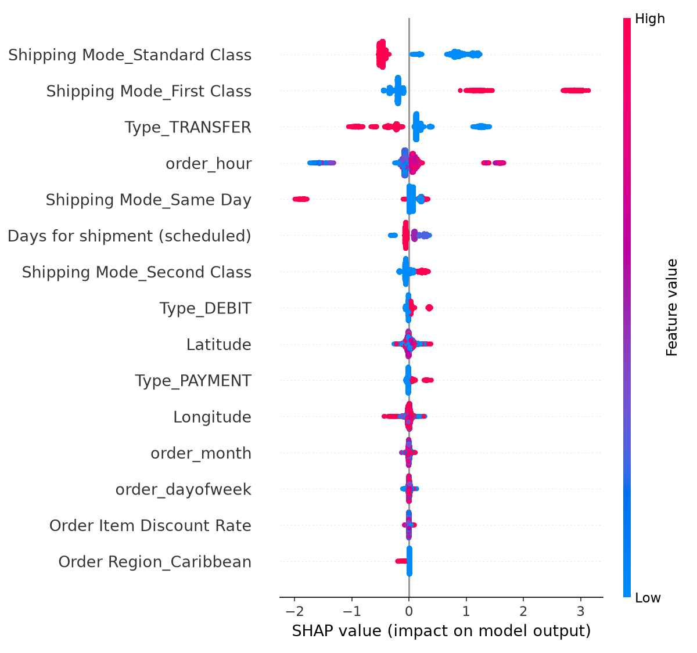
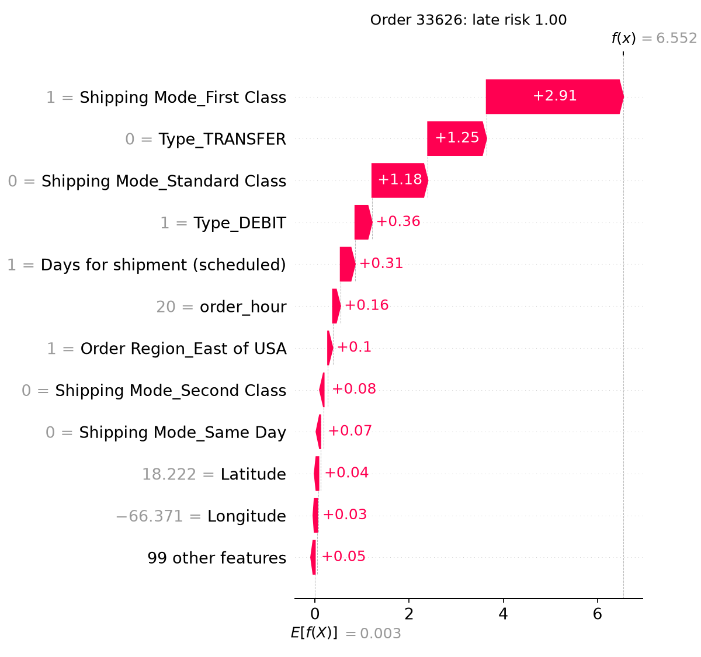

# Supply Chain Late-Delivery Risk Predictor

This project predicts whether a supply chain order will be delivered late. It uses only information available when the order is placed, explains each prediction with SHAP, and shows risk by region, shipping mode and product category in a Streamlit dashboard.

**Stack:** Python, Pandas, Scikit-learn, XGBoost, SHAP, Streamlit

> Status: pipeline, models, SHAP and dashboard all work. Remaining tasks are in [project.md](project.md).

## Dataset

[DataCo Smart Supply Chain for Big Data Analysis](https://www.kaggle.com/datasets/shashwatwork/dataco-smart-supply-chain-for-big-data-analysis) (Kaggle). The pipeline downloads the data automatically with `kagglehub` on the first run.

| Fact | Value |
|---|---|
| Order lines (rows) | 180,519 |
| Unique orders (`Order Id`) | 65,752 |
| Columns | 53 |
| Target | `Late_delivery_risk` (1 = late) |
| Late / not late | 98,977 (54.8%) / 81,542 (45.2%) |
| Markets / order regions | 5 / 23 |
| Shipping modes | 4 |
| Product categories | 50 |

Each row is one order line, so one order can have several rows.

Late rate by shipping mode: First Class 95.3%, Second Class 76.6%, Same Day 45.7%, Standard Class 38.1%.

## Preventing leakage

**Dropped columns.** These columns are only known after the order ships, or they restate the target:

| Column | Reason |
|---|---|
| `Days for shipping (real)` | Actual transit time; the label is defined as real days > scheduled days |
| `Delivery Status` | Contains "Late delivery" directly |
| `Order Status` | Set after fulfilment (COMPLETE, CANCELED, ...) |
| `shipping date (DateOrders)` | Known only once the order ships |

Personal and ID columns (names, email, password, street, image URL, IDs) are also left out.

`src/features.py` uses an explicit whitelist of 17 order-time features. An assert stops the pipeline if any leakage column gets into the feature matrix.

**Split by order.** Lines from the same order share a timestamp, location and outcome. A random row split puts lines from one order in both the train and test sets, so the model memorises those orders.

We measured this effect. With a random row split, XGBoost scored ROC-AUC 0.876. With a split by order, the same model scored 0.759. The final pipeline uses `StratifiedGroupKFold` grouped by `Order Id` (one fold = 80/20). Every order sits entirely in train or entirely in test, and an assert checks this.

## Class imbalance

The classes are mildly imbalanced (55/45):

- Logistic Regression and Random Forest use `class_weight="balanced"`.
- XGBoost uses `scale_pos_weight` = negatives / positives on the training set (0.824).

## Features

| Type | Features |
|---|---|
| Categorical (one-hot) | Shipping Mode, Market, Order Region, Category Name, Department Name, Customer Segment, Type (payment method) |
| Numeric (scaled) | Days for shipment (scheduled), Order Item Quantity, Order Item Discount Rate, Product Price, Sales, Latitude, Longitude, order month / day of week / hour |

## Results

The test set holds 36,104 order lines, and no test order appears in training. The decision threshold is 0.5.

| Model | Accuracy | Precision | Recall | F1 | ROC-AUC |
|---|---|---|---|---|---|
| **XGBoost** | 0.717 | 0.860 | 0.578 | 0.691 | **0.770** |
| Random Forest | 0.717 | 0.859 | 0.578 | 0.691 | 0.765 |
| Logistic Regression | 0.695 | 0.854 | 0.535 | 0.658 | 0.742 |

XGBoost settings: `max_depth=4`, `n_estimators=300`, `learning_rate=0.05`. These were chosen on a separate grouped validation fold inside the training set, not on the test set. Every setting tried scored about 0.77 ROC-AUC, which looks like the limit of what order-time features can predict.

## Explainability (SHAP)

`src/explain.py` runs `shap.TreeExplainer` on the XGBoost model using a sample of 5,000 orders.

The top risk drivers are listed below, as mean |SHAP| summed over each feature's one-hot columns:

1. Shipping Mode (1.42). First Class is late 95% of the time.
2. Type, the payment method (0.43). TRANSFER orders are late less often.
3. Order hour (0.16)
4. Days for shipment (scheduled) (0.11)
5. Order Region (0.06)



The waterfall plot below explains a single high-risk order:



## Dashboard

```bash
streamlit run app.py
```

The dashboard includes:

- Sidebar filters for Market, Order Region, Shipping Mode and Category, plus a "test-set orders only" toggle.
- Headline numbers: order lines, actual late rate and mean predicted risk.
- Tabs showing risk by region, by shipping mode and by product category (top 25).
- An order lookup that shows an order's risk score and its SHAP waterfall.
- A model comparison table.

## Project structure

```
.
├── src/
│   ├── features.py      # download, load, leakage-safe feature table
│   ├── train.py         # grouped split, 3 models, metrics, saves XGBoost + scored orders
│   └── explain.py       # SHAP summary, importance, example waterfall
├── app.py               # Streamlit dashboard
├── reports/             # model_comparison.csv, shap_importance.csv, plots
├── data/raw/            # Kaggle CSV (not committed)
├── models/              # saved pipeline + scored orders (not committed)
├── requirements.txt
└── project.md           # task checklist
```

## Run

```bash
python -m venv .venv
.venv\Scripts\activate           # Windows
pip install -r requirements.txt

cd src
python features.py               # downloads data, prints dataset facts
python train.py                  # trains and compares models (about 2 min)
python explain.py                # SHAP plots
cd ..
streamlit run app.py
```

## Limitations

- Late delivery depends mostly on shipping mode. First Class orders are almost always late, which points to how DataCo set its schedules rather than to real-world transit times.
- The dashboard scores every order, including training orders. Turn on "test-set orders only" to see results on unseen orders.
